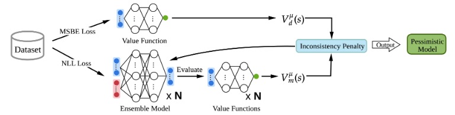
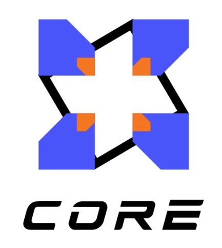

# VIPO: Value Function Inconsistency Penalized Offline Reinforcement Learning


<p align="center">
  
</p>

<p align="center">
  <a href="https://arxiv.org/abs/2504.11944">
    
  </a>
  <a href="https://github.com/NUS-CORE/vipo_torch">
    
  </a>
  <a href="https://nus-core.github.io/assets/standalone/vipo/">
    
  </a>
  <a href="LICENSE">
    
  </a>
</p>

<p align="center">
  Xuyang Chen, Keyu Yan, Guojian Wang, Lin Zhao
</p>

<p align="center">
  
</p>

<p align="center">
  <strong>Official PyTorch implementation</strong>
</p>


## Overview

This repository contains the official implementation of **VIPO: Value Function Inconsistency Penalized Offline Reinforcement Learning**.

VIPO is a model-based offline reinforcement learning method that improves dynamics model learning by introducing a value function inconsistency penalty. Instead of relying only on heuristic uncertainty estimation, VIPO uses the discrepancy between value estimates from offline data and model-generated rollouts as an additional self-supervised signal for model training.

We are still in the process of updating and organizing this repository. The current version includes the core implementation, while some configuration files, scripts, and usage instructions are still being added.


## News

- `[2026-05]` Initial repository release.

## Quickstart

Install D4RL and pytorch.

VIPO is integrated into OfflineRL-Kit and LEQ, see [guidance](vipo/README.md).


## Acknowledgements

Our implementation is developed with reference to several excellent open-source repositories, including:

<ul>
  <li><a href="https://github.com/Farama-Foundation/D4RL">D4RL</a></li>
  <li><a href="https://arxiv.org/abs/2407.00699">LEQ</a></li>
  <li><a href="https://github.com/yihaosun1124/OfflineRL-Kit">OfflineRL-Kit</a></li>
</ul>

We sincerely thank the authors and maintainers of these repositories for their valuable contributions to the offline reinforcement learning community.


## Citation

If you find this work useful, please consider citing our paper:

```bibtex
@misc{chen2026vipovaluefunctioninconsistency,
      title={VIPO: Value Function Inconsistency Penalized Offline Reinforcement Learning}, 
      author={Xuyang Chen and Keyu Yan and Guojian Wang and Lin Zhao},
      year={2026},
      eprint={2504.11944},
      archivePrefix={arXiv},
      primaryClass={cs.LG},
      url={https://arxiv.org/abs/2504.11944}, 
}
```